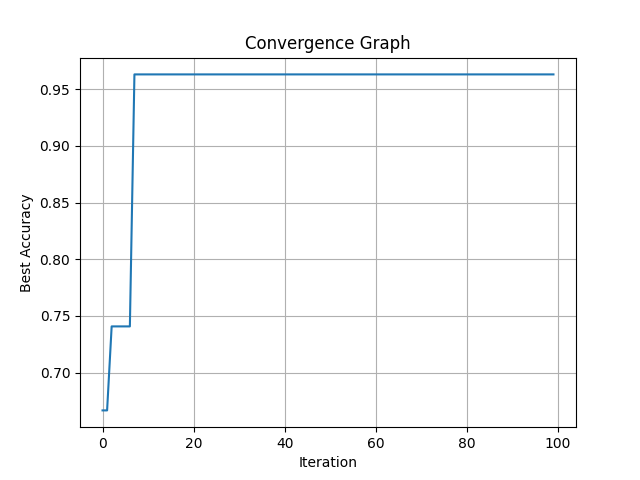

# SVM Optimization using Random Search

## Project Description
This project demonstrates optimizing Support Vector Machine (SVM) hyperparameters using a random search strategy. The script uses the Wine dataset from scikit-learn to evaluate different kernel types and regularization parameters to maximize classification accuracy.

## Objectives
1. Load the Wine dataset.
2. Perform random search optimization on SVM hyperparameters.
3. Evaluate SVM models with different kernels and parameters.
4. Save convergence data and accuracy results.
5. Generate a convergence graph to visualize the optimization process.

## Input
The script uses the built-in Wine dataset from `sklearn.datasets`. The dataset has:
- **Features**: Chemical analysis attributes of wine samples.
- **Target**: Classification labels for wine types (0, 1, or 2).

Example structure of the dataset:
| Feature             | Value  |
|---------------------|--------|
| Alcohol             | 14.23  |
| Malic Acid          | 1.71   |
| Ash                 | 2.43   |
| Alcalinity of Ash   | 15.6   |
| ...                 | ...    |
| Target (Wine Class) | 0      |

## Output
### Convergence Graph:
Below is an example of the convergence graph generated by the script:



### Generated Files:
1. **Convergence Graph** (`convergence_graph.png`):
   - Visualizes the best accuracy achieved across iterations.
2. **Results CSV** (`SVM_Convergence_Data.csv`):
   - Contains details of each iteration, including the kernel used, regularization parameter, and best accuracy achieved.

### Example of `SVM_Convergence_Data.csv`:
| Iteration | Best Accuracy | Best Kernel | Best Nu |
|-----------|---------------|-------------|---------|
| 0         | 0.9778        | linear      | 0.5678  |
| 1         | 0.9778        | linear      | 0.3456  |
| 2         | 0.9889        | rbf         | 0.4567  |

### Console Output:
- Current working directory.
- Paths for saved files.
- Best accuracy and parameters.

Example:
```
Current working directory: /path/to/project
Convergence graph saved at: /path/to/project/convergence_graph.png
Results saved at: /path/to/project/SVM_Convergence_Data.csv
Best Accuracy: 0.9889
Best SVM Parameters: Kernel=rbf, Nu=0.4567
```

## Steps to Run the Project
1. Clone the repository:
   ```bash
   git clone https://github.com/bansal9855/Svm_Optimization/tree/main
   ```
2. Navigate to the project directory:
   ```bash
   cd SVMOptimization
   ```
3. Install required dependencies:
   ```bash
   pip install pandas matplotlib scikit-learn
   ```
4. Run the script:
   ```bash
   python main.py
   ```

## File Structure
```
SVMOptimization/
├── main.py                      # Main script for SVM optimization
├── convergence_graph.png         # Convergence graph (generated after running)
├── SVM_Convergence_Data.csv      # Optimization results (generated after running)
└── README.md                    # Project documentation
```

## Key Learning Outcomes
- SVM optimization using random search.
- Visualization of optimization results with Matplotlib.
- Model performance evaluation using accuracy scores.

## Use Case
This project showcases the ability to:
- Perform hyperparameter tuning for machine learning models.
- Apply classification algorithms effectively.
- Visualize and analyze optimization processes.


